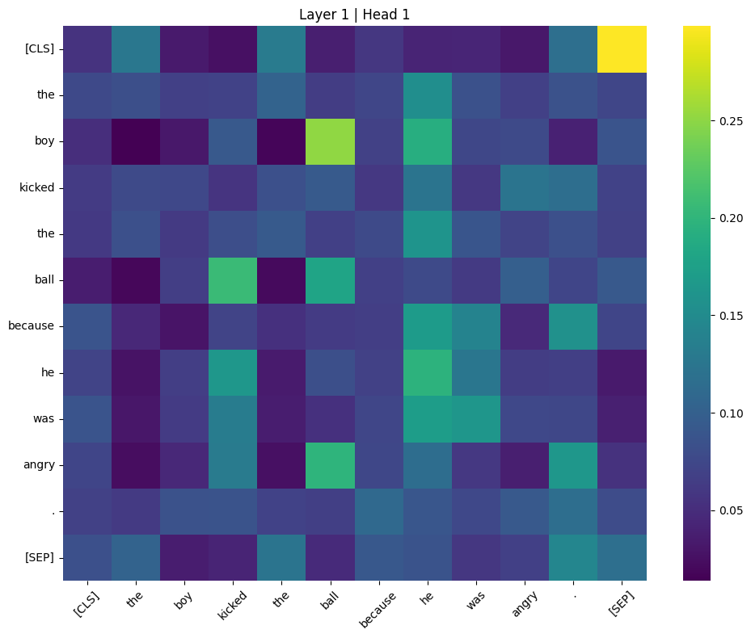
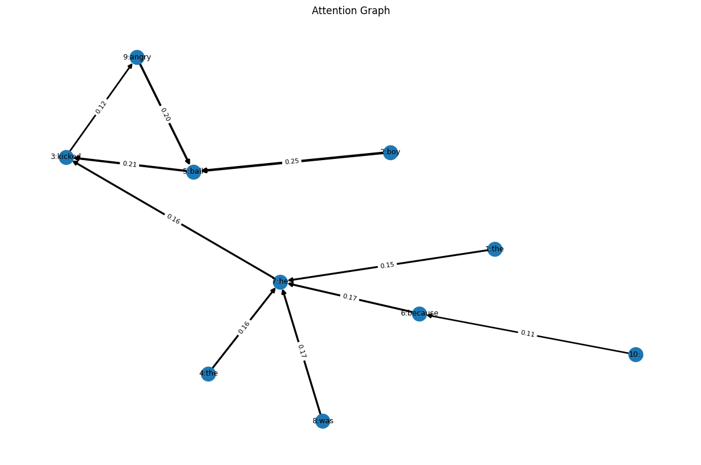
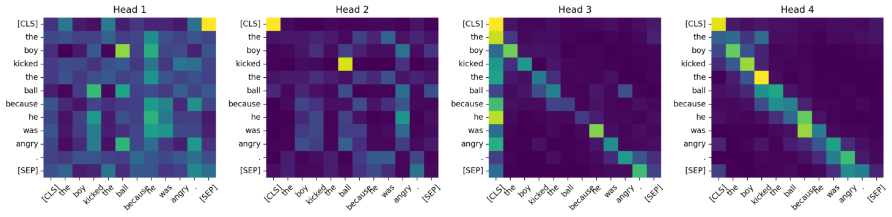

# 🧠 BERT Attention Explorer

An interactive web application for exploring and visualizing attention patterns inside BERT transformers.

**Live Demo:** https://pravesh-bert-attention-explorer.streamlit.app/

---

## Overview

BERT Attention Explorer helps users understand how transformer models distribute attention across tokens. Instead of treating BERT as a black box, this tool exposes attention mechanisms through multiple visualization techniques.

---

## Features

### Attention Heatmaps

Visualize attention matrices for any layer and attention head.

### Token-Level Analysis

Inspect how a selected token distributes its attention across other tokens.

### Attention Graph Visualization

View strongest attention connections as a directed graph.

### Multi-Head Comparison

Compare multiple attention heads side-by-side to understand how different heads learn different patterns.

### Export Functionality

* Download Heatmaps as PNG
* Download Attention Graphs as PNG
* Export Attention Matrices as CSV

### Interactive Controls

* Select Layer (1–12)
* Select Attention Head (1–12)
* Choose Number of Heads for Comparison
* Toggle Attention Edge Weights

---

## Demo Screenshots

### Heatmap View



---

### Attention Graph



---

### Multi-Head Comparison



---

## Tech Stack

### Frontend

* Streamlit

### Deep Learning

* PyTorch
* Hugging Face Transformers

### Visualization

* Matplotlib
* Seaborn
* NetworkX

### Data Processing

* NumPy
* Pandas

---

## Local Installation

Clone the repository:

```bash
git clone https://github.com/praveshdev3/bert-attention-explorer.git

cd bert-attention-explorer
```

Create a virtual environment:

```bash
python -m venv venv
```

Activate it:

### macOS / Linux

```bash
source venv/bin/activate
```

### Windows

```bash
venv\Scripts\activate
```

Install dependencies:

```bash
pip install -r requirements.txt
```

Run the application:

```bash
streamlit run app/app.py
```

---

## Example Sentences

Try these examples:

```text
The boy kicked the ball because he was angry.
```

```text
Alice gave Bob her book because she trusted him.
```

```text
The trophy would not fit in the suitcase because it was too big.
```

These sentences often reveal interesting attention patterns and coreference behavior.

---

## What I Learned

Through this project I explored:

* Transformer Architecture
* Self-Attention Mechanisms
* Multi-Head Attention
* BERT Internals
* Attention Visualization
* Model Interpretability
* Hugging Face Transformers
* Streamlit Application Development
* Deployment and Model Serving

---

## Live Application

https://pravesh-bert-attention-explorer.streamlit.app/

---

## License

This project is intended for educational and learning purposes.
